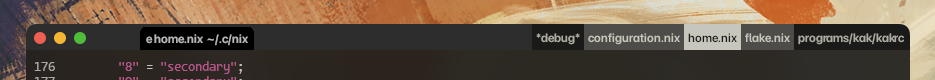

# buflist



A small plugin for Kakoune/WezTerm to add a buffer list to WezTerm's
titlebar. Inactive buffers are delimited via alternated colors. Requires
`luajit`.

To install, place

```bash
source /path/to/buflist.kak
```

in Kakoune's configuration, and

```lua
-- With 'buflist.lua' in '$XDG_CONFIG_HOME/wezterm':
(require "buflist").start(
    ACTIVE_BG,
    ACTIVE_FG,
    INACTIVE_BG1,
    INACTIVE_FG1,
    INACTIVE_BG2,
    INACTIVE_FG2
)
```

in WezTerm's configuration.
