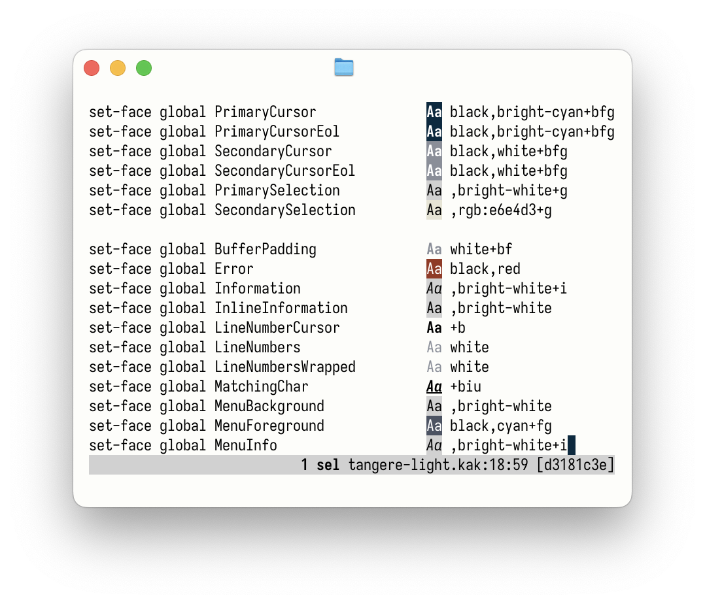

# swatch



A Kakoune plugin which highlights hex colors and Kakoune faces, with no shell forks.

To install, place

```bash
source /path/to/swatch.kak
hook global WinCreate '.*' swatch-enable-window
```

in Kakoune's configuration.
